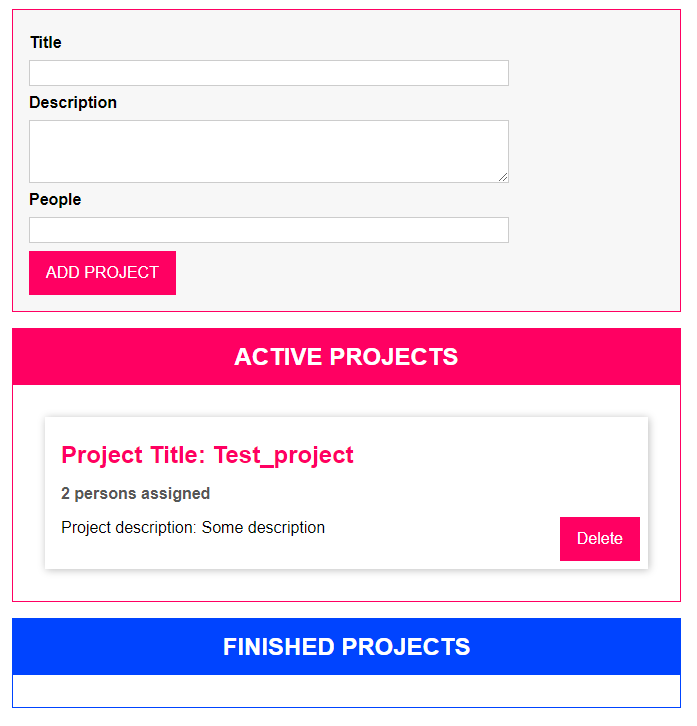

# Drag & Drop Project Manager
> Simple project management app build with Typescript and Webpack.
> Live demo [_here_](https://noszczykmichal.github.io/drag-and-drop/index.html).

## Table of Contents
* [General Info](#general-information)
* [Technologies Used](#technologies-used)
* [Screenshots](#screenshots)
* [Setup](#setup)
* [Project Status](#project-status)
* [Room for Improvement](#room-for-improvement)
* [Acknowledgements](#acknowledgements)
* [Contact](#contact)


## General Information
- A small demo app which was build during online course on Typescript.
- The app allows to manage lists of active and finished projects (you can add new projects, move     them betweeen lists as well as delete them). 
- Thanks to this project I've learned basics of Typesript and OOP.

## Technologies Used
- [Typescript](https://www.typescriptlang.org/) - a programming language developed by Microsoft that builds up on JavaScript
- [Webpack](https://webpack.js.org/) - a module bundler which main purpose is to bundle JavaScript file for usage in a browser

## Screenshots



## Setup
Do you want to play around with this app and check how it works?
Just follow this few simple steps:

1. Download project locally.
2. Using IDE of your choice install all the dependencies with npm:
```
$ npm install
```
3. Run project in your browser: 
```
$ npm start
```


## Project Status
Project is still in development and consistent improvements will be made in the future.


## Room for Improvement
Room for improvement:
- responsive design also for mobile devices
- storage of projects locally


## Acknowledgements
- This project was based on [Understanding TypeScript - 2022 Edition by Maximilian Schwarzmüller](https://www.udemy.com/course/understanding-typescript/).


## Contact
Created by [@noszczykmichal](https://noszczykmichal.github.io/portfolio/index.html#contact) - feel free to contact me!
